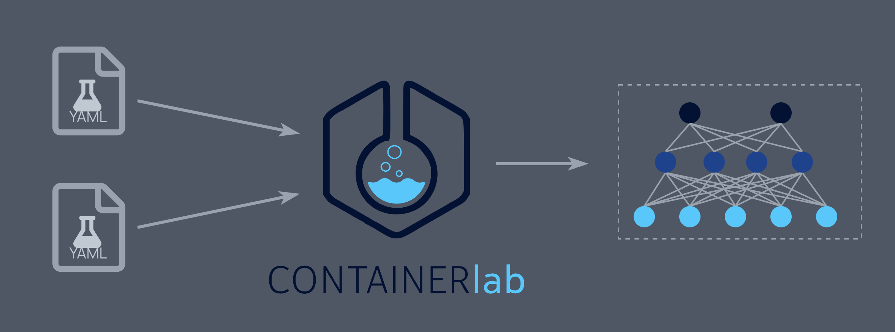

# Arista Containerlab Labs


## About

This repository is configured to run [`Arista cEOS`](https://containerlab.dev/manual/kinds/ceos/) virtual labs using [`Containerlab`](https://containerlab.dev/) . Example labs can be found in the 'Labs' directory with accompanying details.

<p align="center">
  
</p>

To access an ATD topology, please get in touch with your Arista representative.

## Lab topology

Each lab example will include a readme detailing the topology used.

## Getting Started

The following steps need to be followed to successfully run the cEOS labs with Containerlab

### Install Docker


1. Follow the appropriate steps to install docker on your enviornment: https://docs.docker.com/engine/install/

     Example: Install docker using the convenience script on linux

    ```shell
    curl -fsSL https://get.docker.com -o get-docker.sh
    sudo sh get-docker.sh
    sudo sh get-docker.sh
    ```
 
     To confirm that docker is succesfully installed run the following test.

    ```shell
    sudo docker run hello-world
    ```
### Install Containerlab


1. Follow the appropriate steps to install docker on your enviornment: https://containerlab.dev/install/

   Example: Install dContainerlabusing the convenience script on linux

      bash -c "$(curl -sL https://get.containerlab.dev)"

    ```shell
    bash -c "$(curl -sL https://get.containerlab.dev)"
    ```


### Installing Arista cEOS-Lab docker image

1. Download the cEOS image from www.arista.com

      -Software Downloads
         -cEOS-Lab
            -EOS-4.2x.y
               cEOS-lab-4.2x.y.tar.xz

2. Copy the cEOS-lab-4.2x.y.tar.xz to the host/server/VM.

3. Ensure Docker is already set up and running.

    ```shell
    docker version
    ```

4. Use the tar file to import the cEOS image to create a docker image ready for use

   ```shell
   docker import cEOS-lab-4.30.4M.tar.xz ceos:4.30.4M
   ```

    NOTE 1: make sure the docker import command is referncing the exact version you downloaded 

    NOTE 2: The tag is important, make sure to add "ceos" and the version 

5. Confirm that the cEOS image is ready using the following command

    ```shell
    docker images | egrep "REPO|ceos"
    ```
### Clone this repository to your machine

1. navigate to the directory you want this repository downloaded to

2. Use the following command

   ``` git clone https://github.com/amgadk/arista-containerlab.git```
   
Note: If git isn't installed you will get an error (install git if necessary)

### Installing linux host docker image

1. navigate to the alpine-host directory

2. Use the build.sh bash script to build the image (This will install the docker image)

   ```shell
   ./build.sh
   ```

   NOTE: If permission is denied use the following command 'chmod +x build.sh' 

3. Verify the alpine-host image is created

   ```shell
   docker images | egrep "TAG|alpine"
   ```

### Deploy topology using Containerlab

1. Navigate to where the topology.yaml is

2. The following command will deploy the lab

    ```shell
    sudo containerlab deploy -t topology.yaml
    ```

3. After the lab is deployed you can check it's status with the following command

    ```shell
    sudo containerlab inspect -t topology.yaml
    ```


4. To access cEOS devices use ssh and the ip address (username and password are admin)

    ```shell
    ssh admin@172.16.1.101
    ```

5. To access linux hosts use the following command

    ```shell
    sudo docker exec -it clab-host1 /bin/sh
    ```

   Note: The container name is used "clab-host1", you will see this when you run the containerlab inspect command (step 3)


## Resources

- [Containerlab](https://containerlab.dev/)
- [Arista AVD documentation](https://avd.arista.com)

